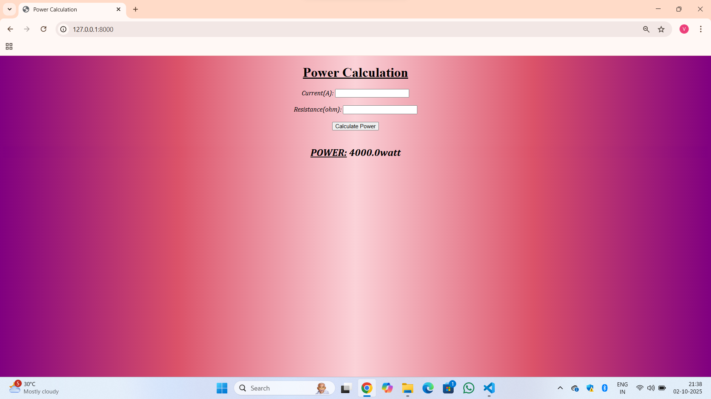

# Ex.05 Design a Website for Server Side Processing
# Date:02-10-25
# AIM:
To design a website to calculate the power of a lamp filament in an incandescent bulb in the server side.

# FORMULA:
P = I2R
P --> Power (in watts)
 I --> Intensity
 R --> Resistance

# DESIGN STEPS:
## Step 1:
Clone the repository from GitHub.

## Step 2:
Create Django Admin project.

## Step 3:
Create a New App under the Django Admin project.

## Step 4:
Create python programs for views and urls to perform server side processing.

## Step 5:
Create a HTML file to implement form based input and output.

## Step 6:
Publish the website in the given URL.

# PROGRAM :
```
power.html:
<!DOCTYPE html>
<html lang="en">
<head>
    <meta charset="UTF-8">
    <meta name="viewport" content="width=device-width, initial-scale=1.0">
    <title>Power Calculation</title>
<style>
    h1{
        font-family: 'Times New Roman', Times, serif;
        text-align: center;
        font-style: normal;
        font-weight: bolder;
    }
    body,h2{
        font-family: Cambria, Cochin, Georgia, Times, 'Times New Roman', serif;
        font-style: italic;
        background-image: linear-gradient(90deg,purple,rgb(219, 82, 105),rgb(251, 210, 216),rgb(219, 82, 105),purple);
    }
</style>    
</head>
<body align="center">
    <h1><u>Power Calculation</u></h1>
    <form method="post">
        
        <label>Current(A):</label>
        <input type="text" name="current" required><br><br>
        <label>Resistance(ohm):</label>
        <input type="text" name="resistance" required><br><br>
        <button type="submit">Calculate Power</button>
    </form><br>
    <h2 align="center"><u>POWER:</u> {{POWER}}watt</h2>
</body>
</html>

views.py:
from django.shortcuts import render

def act(request):
    current = ""
    resistance = ""
    power = None
    if request.method == "POST":
        current=float(request.POST.get("current"))
        resistance=float(request.POST.get("resistance"))
        power=current*current*resistance
        print(f"Current:{current} A,Resistance:{resistance} ohm,POWER:{power:.2f}")
    return render(request,"power.html",{'POWER':power})

urls.py:
from django.contrib import admin
from django.urls import path
from app import views

urlpatterns = [
    path('admin/',admin.site.urls),
    path('',views.act),
]
```
# SERVER SIDE PROCESSING:





# HOMEPAGE:

# RESULT:
The program for performing server side processing is completed successfully.
